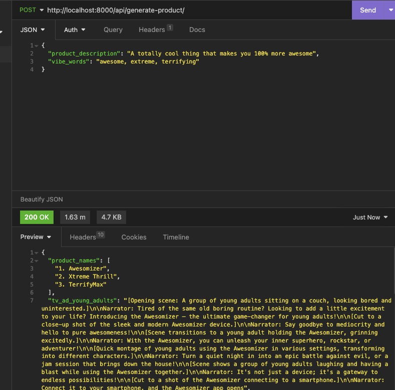
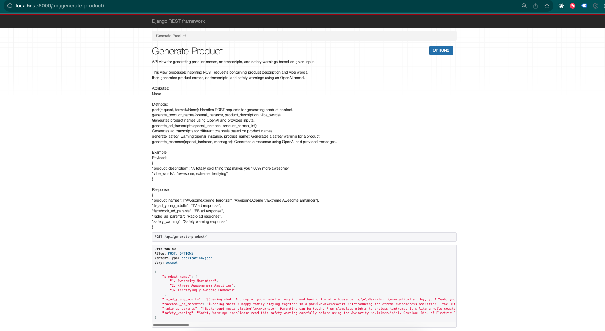

# My Open Test README

This README provides a step-by-step guide on setting up and running the Django project. It covers installing Python 3.8, creating a virtual environment, installing project dependencies from `requirements.txt`, performing database migrations, and accessing the specified URL.

## Table of Contents

- **[Prerequisites](#prerequisites)**
- **[Setup](#setup)**
  - **[1. Install Python 3.8](#1-install-python-38)**
  - **[2. Create a Virtual Environment](#2-create-a-virtual-environment)**
  - **[3. Install Dependencies](#3-install-dependencies)**
  - **[4. Perform Database Migrations](#4-perform-database-migrations)**
  - **[5. Access the URL](#5-access-the-url)**
  - **[6. Sample API response images](#6-sample-images)**
  - **[7. Add your OpenAi API KEY](#7-openaikey)**


## Prerequisites

Before you begin, make sure you have the following installed on your system:

- Python 3.8 (or higher)
- `virtualenv` (install using `pip install virtualenv`)

## Setup

Follow these steps to set up and run the Django project:

### 1. Install Python 3.8

If you don't have Python 3.8 installed, download and install it from the [official Python website](https://www.python.org/downloads/).

### 2. Create a Virtual Environment

Open your terminal or command prompt and navigate to your project directory.

```bash
cd /path/to/your/project
```

Create a virtual environment named venv:

```bash
python3.8 -m venv venv
```

Activate the virtual environment:

```bash
source venv/bin/activate
```

### 3. Installing requirements/dependencies

While the virtual environment is active, install the project dependencies from requirements.txt:

```bash
pip install -r requirements.txt
```

### 4. Running migrations

Run database migrations to set up the initial database schema:

```bash
python manage.py migrate
```

### 5. Accessing the product generator URL

You can now access the specified URL for generating a product. In your browser, go to:

[http://localhost:8000/api/generate-product/](http://localhost:8000/api/generate-product/)

Replace `localhost` with the appropriate hostname or IP address if your development server is running on a different address.

### 6. Accessing the product generator URL

Sample images from the API




### 6. Important note add OpenAI API Key

Create .env file, add it on root directory and add this variable OPENAI_API_KEY=REPLACE with your own key
